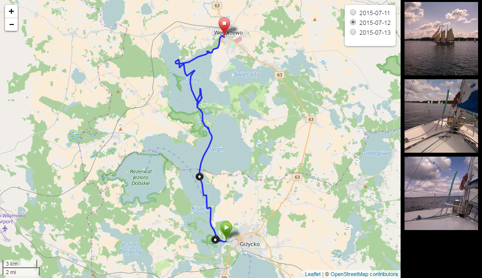

# geomapped

Interactive map with GPX trails and geotagged photographs.

Work in progress.



Loads two sets of data:

* GPX files
* GeoJSON files, containing data extracted from geotagged photos. Generated by
included Python script.

## todo
- geojson builder - pass directory as parameter, copies to img, makes thumbs
- General refactor - pass photoData, trackData as a parameter to library and
operate on already defined map.
- Populate framecontent on the fly - maybe pass div name as a parameter?
- remove legacy code

## prerequisites

* Python 3 with PIL module. Required for generating aforementioned GeoJSON files.
* JavaScript-capable web browser (duh)

## usage

TBD

## examples

public_html folder contains usage example along with example data.

Run `build.py`, host `public_html` directory on a webserver and access
example.html to see it in action.

```
python build.py
cd public_html
python -m http.server
firefox http://localhost:8000/example.html
```

## license

MIT License